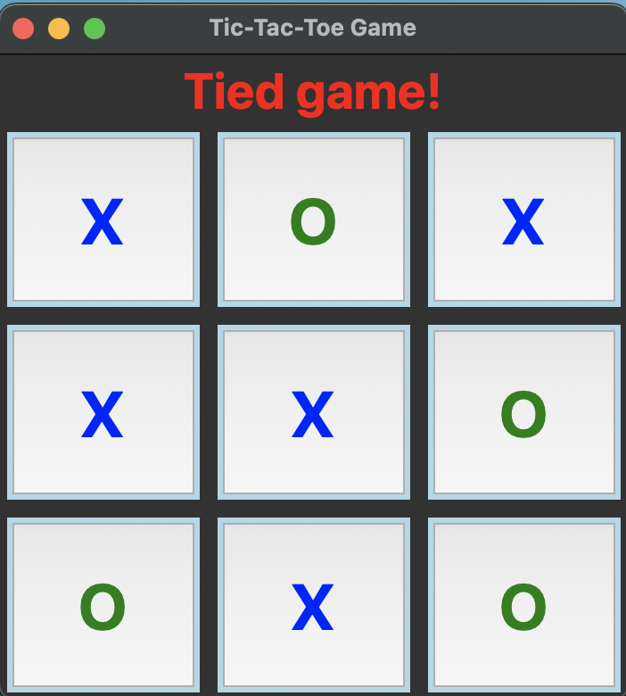

# Build a Tic-Tac-Toe Game With Python and Tkinter
[](https://www.python.org)

- Program the classic tic-tac-toe game’s logic using Python
- Create the game’s graphical user interface (GUI) using the Tkinter tool kit
- Integrate the game’s logic and GUI into a fully functional computer game

## Learning Goal

Major things that I want to focus on learning in this project

- Python GUI Programming with Tkinter
- Object-Oriented Programming in Python3
- When to use List Comprehension in Python
- Dictionaries in Python and how to interate through a Dictionary

## Technology
- Python 3.11
- Tkinter

## Installation

- The game uses Tkinter to build its user interface.
- Install Tkinter and make suure a version of Tkinter greater than or equal to 8.6.

## Run the Game

To run the game, just execute the following command on your command line:
```bash
$ python tic_tac_toe.py
```

## ScreenShot
<p align="center">
  
</p>

## Connect with me!

[](https://linkedin.com/in/annieyentran/)  [](https://github.com/momofAnAl)

## Email Me :e-mail:
[](mailto:anhtr077@gmail.com)

